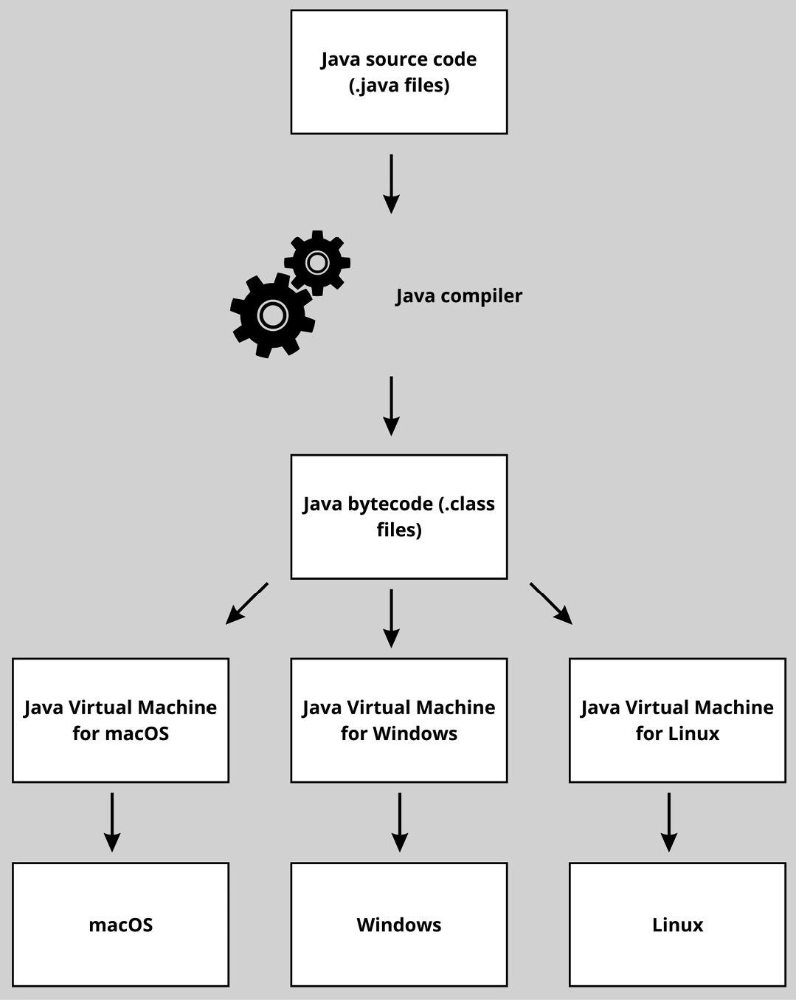
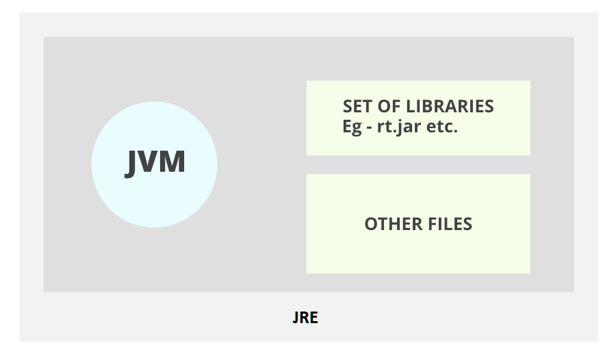

## JVM이란 무엇인가
Java Virtual Machine 
java는 OS에 종속적이지 않음

보통의 프로그램/프로세스들은 OS가 실행시킴
==> 그러면 Java는 무엇이 실행시킬까?

OS 위에서 java를 실행시킬 것이 필요함
==> OS에 종속받지 않고, CPU가 Java를 인식할 수 있게 하는 가상 컴퓨터

java 소스코드 (*.java 파일)은 CPU가 인식하지 못함
==> 기계어로 컴파일 해주어야 함

가상머신(VM)을 거쳐서 OS에 도달함
맨 처음에 가상머신(VM)도 바로 인식할 수 없음
source code (.java file) => [java compiler] => java byte code(.class file) => [JVM] => [OS] => execution!

* 다만 자바 프로그램과는 달리 JVM은 운영체제에 종속적이므로 운영체제에 맞는 자바 가상머신을 설치할 필요가 있음   

## 컴파일 하는 방법

Java Compiler에 의해서 .java 파일이 .class (byte code)로 바뀜
JDK의 `./bin/javac.exe` 파일이 Java Compiler
`javac [java 소스코드 파일 이름].java` 를 실행하면 컴파일됨
==> .class 파일이 생성됨

## 실행하는 방법

<example!>
java source code file name: minji
cmd> javac minji.java  // compiler execution, class file create 
cmd> java minji        // type class file name, and execute 

## 바이트 코드란 무엇인가
**VM에서 돌아가는 실행 프로그램을** 위한 이진 표현법
자바에서의 byte code는 JVM이 이해할 수 있는 언어로 변환된 java source code를 의미함 (not binary code)

java compiler에 의해서 변환된 코드의 명령어 크기가 1바이트라서 자바 바이트 코드라고 불림

어떤 OS든 상관 없이 호환되는 JVM이 있다면 바이트코드로 컴파일 된 파일은 어디서든 실행할 수 있음
JVM이 플랫폼 환경에 맞추어 바이트 코드에서 기계어로 변환 => 플랫폼 환경에 따라 다시 컴파일 하지 않아도 됨

## JIT 컴파일러란 무엇이며 어떻게 동작하는지
JIT(just-in-time) Compiler는 Java Runtime Environment의 필수적인 부분임
런타임 또는 자바 어플리케이션의 성능 최적화를 담당함

자바 어플리케이션 속도: 바이트 코드 -> 기계어 코드 변환 방식에 따라서 달라짐

javac compiler를 통해서 소스 코드를 바이트 코드로 컴파일함
JVM은 런타임에 바이트 코드를 로드하고 인터프리터를 사용하여 기계 바이너리 코드로 변환함
자바 바이트 코드 해석 => 기본 어플리케이션에 비해서 성능이 저하됨
JIT 컴파일러는 바이트 코드를 "just-in-time" 적절한 시간에 실행될 수 있는 native machine code로 컴파일하여 성능을 높임   

## JVM 구성 요소   

1. Class loader
2. execution engine
3. runtime data area
4. native method interface
5. native method library

**클래스 로더** : 클래스 파일을 동적으로 로드하고, 링크를 통해 배치하는 작업을 수행함   
로드된 바이트 코드들을 엮어서 JVM 메모리 영역인 Runtime data areas에 배치함
클래스를 메모리에 올릴 때 (load) 한번에 메모리에 올리지 않고, 어플리케이션에서 필요한 경우 동적으로 메모리에 로드함   

load => 클래스 파일을 가져와서 JVM 메모리에 로드
link => 클래스 파일을 사용하기 위해 검증
ㄴ verifying: JVM 명세대로 구성되어있는지 검사
ㄴ preparing: 클래스가 필요로 하는 메모리 할당
ㄴ resolving: 클래스의 상수 풀 내 모든 심볼릭 레퍼런스를 다이렉트 레퍼런스로 변경
initialization => 클래스 변수들을 적절한 값으로 초기화   

   
**실행 엔진** : 클래스 로더를 통해 런타임 데이터 영역에 배치된 바이트 코드를 명령어 단위로 읽어서 실행함   
실행 엔진은 바이트 코드를 JVM 내부에서 기계가 실행할 수 있는 기계어 형태로 변경해줌
이러한 수행 과정에서 Interpreter와 JIT compiler 두가지 방법을 혼합하여 바이트 코드를 실행함   

**Interpreter** : 바이트 코드를 읽고(read) 운영체제가 실행할 수 있도록 기계어로 변경하는 역할
JVM 인터프리터는 런타임 중에 바이트 코드를 한 라인씩 읽고 실행함
바이트 코드 역시 기계어로 변환되어야 하기 때문에 컴파일을 통해 기계어로 변경되는 언어에 비해서 속도가 느려짐
반복문 같은 경우 컴파일 언어와 다르게 인터프리터는 각 줄을 매번 읽고, 번역하여야 함

**JIT compiler** : 자주 실행되는 바이트 코드 영역을 런타임 중에 기계어로 컴파일하여서 사용함
ㄴ **compile threshold** : 컴파일 임계치는 코드 컴파일을 수행할 기준을 의미함. 컴파일 임계치를 만족하는 코드는 JIT 컴파일러에 의해서 컴파일이 수행됨.
컴파일 임계치 = method entry counter(JVM 내에 메소드 호출 횟수) + back-edge loop counter(메소드가 루프를 빠져나오기 전까지 회전한 횟수)   

컴파일 임계치가 일정 횟수에 도달한 코드는 `특정 큐`에 들어가 `컴파일 스레드`에 의해 컴파일 되기를 대기함.
어플리케이션 실행 시 JVM 옵션을 이용해서 컴파일 임계치 값을 조정할 수 있음.
method entry counter 값에 해당되는 임계치는 CompileThreshold이고 back-edge loop counter 값에 대한 임계치는 계산된 값이 매칭됨.

> back-edge loop counter 값을 위한 임계치 = CompileThreashold * OnStackReplacePercentage / 100
> method entry counter 값을 위한 임계치 = CompuleThreashold    

## JDK와 JRE의 차이   

**JDK** : Java Development Kit, 자바 개발 키트. 자바를 개발하는 데에 있어서 필요한 기능 내장.
자바 프로그램을 `개발` 하는데 필요한 것. JDK안에 JRE도 포함되어 있음.   

ㄴ **JRE** : Java Runtime Environment, 자바 런타임 환경. 자바 프로그램을 `실행` 시키는 데에 필요한 환경   

### 참고 자료
(https://people-analysis.tistory.com/246)
(https://doozi0316.tistory.com/entry/1%EC%A3%BC%EC%B0%A8-JVM%EC%9D%80-%EB%AC%B4%EC%97%87%EC%9D%B4%EB%A9%B0-%EC%9E%90%EB%B0%94-%EC%BD%94%EB%93%9C%EB%8A%94-%EC%96%B4%EB%96%BB%EA%B2%8C-%EC%8B%A4%ED%96%89%ED%95%98%EB%8A%94-%EA%B2%83%EC%9D%B8%EA%B0%80)
(https://junhyunny.github.io/information/java/jvm-execution-engine/)
(https://code-lab1.tistory.com/253#google_vignette)