# Java 2주차

## 개요

**변수**(*Variable*)란 값을 저장할 수 있는 메모리의 특정 번지에 붙이는 이름입니다. 변수를 통해 값을 저장하고 읽을 수 있습니다.

---

## 변수 선언과 정의

변수를 선언하는 것과 정의하는 것을 혼용해서 사용하지만, 선언과 정의는 다른 용어입니다.

**선언**(*Declaration*): 변수의 이름과 타입을 지정하여 컴파일러가 해당 변수를 인식할 수 있도록 하는 것.

**정의**(*Definition*): 변수를 선언하고 해당 변수에 메모리를 할당하는 것. 

선언한 변수에 처음 값을 정의하는 것을 ‘**초기화**(*Initialization*)’라고 합니다.

변수를 선언할 때, 다음과 같은 규칙을 따라야 합니다.

- **문자, ‘$’, ‘_’ 외의 글자는 첫 번째로 올 수 없다.**
    
    ex) apple, $dollar, _temp와 같은 변수명을 가질 수는 있지만, 1p, @apple과 같은 변수명을 가질 수 없습니다.
    
- **Java 예약어(Reserved Word)*를 사용할 수 없다.**
    
    ex) 변수명을 int, try, false 등과 같은 예약어를 변수명으로 지정할 수 없습니다.
    

예약어*: 프로그래밍 언어에서 특별한 용도로 미리 정의된 단어

---

## 변수 사용 범위

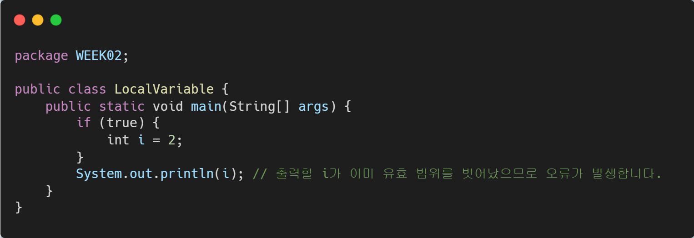

WEEK02/LocalVariable.java

<aside>
📢 **출력 예시**
❗java: cannot find symbol
❗symbol: variable i

</aside>

변수 i는 if문 내에서 초기화되었고,  i의 값을 출력하려고 하면, 오류가 발생합니다. i의 **유효 범위**(*scope*)를 벗어났기 때문입니다.

Java의 모든 변수는 중괄호 블록 내에서 선언되고 사용되며, 메서드의 실행이 종료되면, 메모리에서 **자동으로 해제**됩니다. 

메서드 내에서 선언된 변수를 **지역 변수**(*Local Varible*)라고 합니다.

---

## 프리미티브 타입 종류와 값의 범위 그리고 기본값

**기본 타입**이라고 불리는 **프리미티브 타입**(*Primitive Type*)은 크게 3가지로 나뉘고, 총 8개가 있습니다.

### 정수 타입

정수 타입은 총 5개로, 다음과 같습니다.

| 타입 | 메모리(byte) | 범위 |
| --- | --- | --- |
| byte | 1 | -128(-2^7)~127(2^7-1) |
| short | 2 | -32768(-2^15)~32767(2^15-1) |
| char | 2 | 0~65535(유니코드) |
| int | 4 | -2147483648(-2^31)~2147483647(2^31-1) |
| long | 8 | -9223372036854775808(-2^63)~9223372036854775807(2^63-1) |

0이 양수 부분에 포함되어 있으므로, 음수보다 1 작게 표현됩니다. 1 byte는 8 bit이고, 그 중 1 bit는 기본적으로 부호를 결정하기 때문에, 부호가 있는 N byte의 정수 범위는 -2^(8N-1)~2^(8N-1)-1 입니다.

WEEK02/IntegerLiteral.java

<aside>
📢 **출력 예시**
9 148 1315 179

</aside>

Java는 2진수, 8진수, 10진수, 16진수를 정수로 인식합니다.

WEEK02/LongLiteral.java

<aside>
📢 **출력 예시**
a = 20240124, b = 2345678901

</aside>

**long 타입**은 기본적으로, int로 간주합니다. 따라서, int 범위를 넘어서는 경우, 정수 리터럴* 뒤에 소문자 l 또는 대문자 L을 붙여, 컴파일러가 long으로 인식하게 해야 합니다.

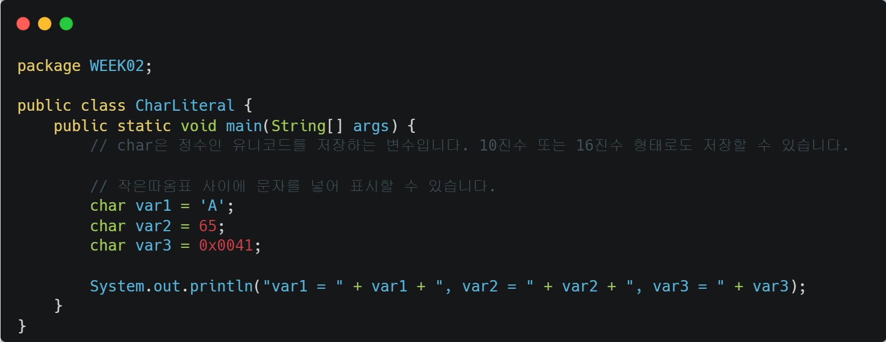

WEEK02/CharLiteral.java

<aside>
📢 **출력 예시**
var1 = A, var2 = A, var3 = A

</aside>

Java에서는 **유니코드**를 저장할 수 있는 2byte 크기인 **char 타입**을 지원합니다. 10진수, 16진수를 인식할 수 있습니다.

### String 타입

하나의 문자는 char 타입 변수로 인식되어 유니코드로 저장되지만, 큰따옴표(”)로 감싼 문자 도는 여러 개의 문자들은 유니코드로 변환되지 않습니다. 큰따옴표 안에 있는 문자들을 **문자열**이라고 부르는데, 문자열을 변수로 저장하고 싶다면, **string 타입**을 사용해야 합니다.

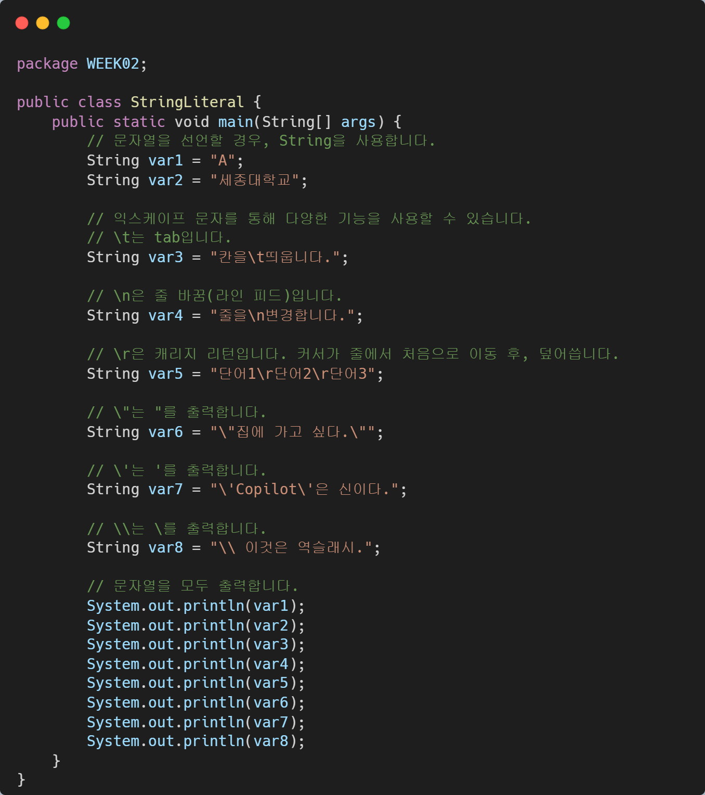

WEEK02/StringLiteral.java

<aside>
📢 **출력 예시**

A
세종대학교
칸을	     띄웁니다.
줄을
변경합니다.
단어3
"집에 가고 싶다."
'Copilot'은 신이다.
\ 이것은 역슬래시.

</aside>

운영체제 또는 IDE에 따라, \n과 \r의 지원 유무 및 처리 방식이 다를 수도 있습니다.

GCP_ubuntu/string.java

대부분의 Unix 기반 시스템에서도 \n과 \r을 동일하게 처리합니다. 위의 운영체제는 ubuntu입니다.

apt install openjdk-17-jdk는 JDK 패키지를 설치한 것입니다. 

vi string.java는 문서편집기를 통해, 코드를 입력할 수 있도록 한 것입니다.

javac는 .java 파일을 바이트코드로 번역하는 작업입니다. .class 파일이 생성됩니다.

변환된 바이트코드를 실행하면 출력됩니다. 이때, .class는 붙이지 않습니다.

 

### 실수 타입

소수점을 저장할 수 있는 타입은 총 2개가 있습니다.

| 타입 | 메모리(byte) | 범위(절댓값 기준) | 정밀도(소수점 이하 자리) |
| --- | --- | --- | --- |
| float | 4 | 1.4 * 10^-45 ~ 3.4 * 10^38 | 7 |
| double | 8 | 4.9 * 10^-324 ~ 1.8 * 10^308 | 15 |

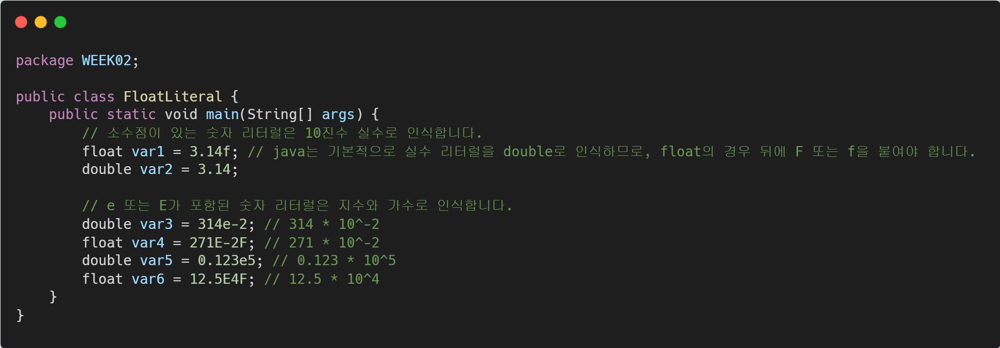

WEEK02/FloatLiteral.java

**double**은 **float**보다 **약** **2배의 정밀도**를 가집니다.

### 논리 타입

Java에서 논리 리터럴로 true와 false를 사용합니다. 타입 이름은 **boolean**이고, 1byte의 크기입니다. 조건문과 제어문에 자주 사용됩니다.

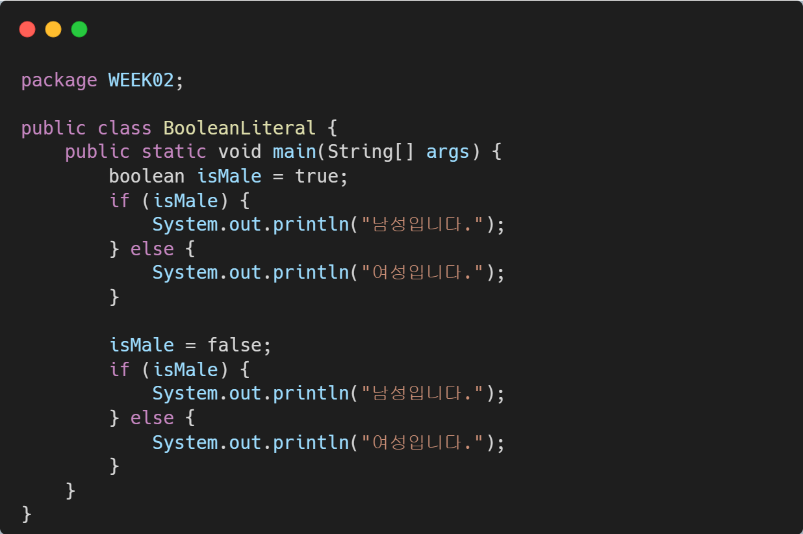

WEEK02/BooleanLiteral.java

<aside>
📢 **출력 예시**

남성입니다.

여성입니다.

</aside>

조건문 내에 isMale이 참(*true*)인 경우 전자를, 거짓(*false*)인 경우 후자를 출력합니다.

### 변수 기본값

**C, C++, Python**에서 **전역 변수**(*Global Variable*)과 **지역 변수**(*Local Variable*)가 있었던 것과 같이, **Java**에서는 **인스턴스 변수**(*Instance Variable*)와 **클래스 변수**(*Class Variable*), 그리고 **지역 변수**(*Local Variable*)이 있습니다. 변수를 초기화하지 않으면, 그 변수에는 쓰레기 값이 담깁니다. 인스턴스 변수와 클래스 변수는 변수의 값이 유지된다는 특징을 가지고 있어, 메서드가 종료될 때 변수가 소멸하는 지역 변수와 달리, 초기화를 하지 않아도 **기본값이 저장**됩니다.

WEEK02/DefaultValue.java

<aside>
📢 **출력 예시**

v_byte = 0
v_short = 0
v_int = 0
v_long = 0
v_char =
v_string = null
v_float = 0.0
v_double = 0.0
v_boolean = false

</aside>

다음과 같이 출력되며, char의 경우, 기본값은 '\u0000'이며, IDE의 지원 환경에 따라, 위와 같이 출력되지 않을 수 있습니다.

리터럴*: 소스 코드에서 개발자에 의해 직접 입력된 값

---

## 래퍼런스 타입

자료형에는 크게 **프리미티브 타입**과 **래퍼런스 타입**으로 나뉩니다.

call_by_reference.cpp

<aside>
📢 **출력 예시**

10 10

15 15

</aside>

**Reference**는 ‘**참조**’를 뜻하며, 이 **참조 타입**은 실제 값이 저장되지 않고, 자료가 저장된 공간의 주소를 저장하는데, 이는 C++과 유사합니다.

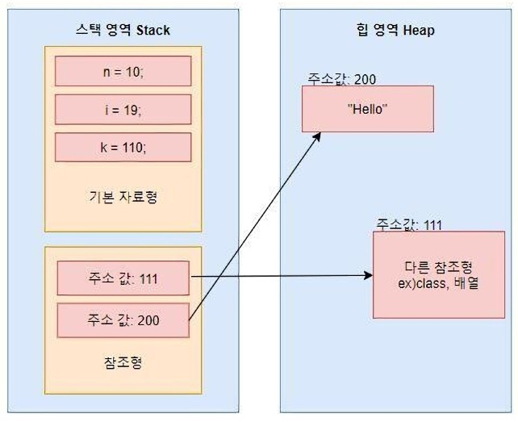

**Heap**에는 **실제 값이 저장**되고, 그 **실제 값을 가리키는 변수**는 **stack**에 저장됩니다.

실제 값을 가리키는 stack이 사라진다면, **JVM**은 이를 감지하여 **가비지 컬렉터**(*Garbage Collector*)에서 **자동으로 제거**합니다. 자바는 다른 언어와 달리 코드를 통해 객체를 직접 **해제**(*delete*)하는 방법을 제공하지 않습니다.

참조형 변수는 null로 초기화할 수 있습니다.

래퍼런스 타입의 종류는 4개가 있으며, 다음과 같습니다.

| 타입 | 메모리(byte) | 기본값 |
| --- | --- | --- |
| Array(배열) | 4 | null |
| Enumeration(열거) | 4 | null |
| Class(클래스) | 4 | null |
| Interface(인터페이스) | 4 | null |

래퍼런스 타입은 주소를 저장하므로 4 byte가 할당됩니다.

---

## 클래스 변수와 인스턴스 변수

다른 언어에서는 전역 변수를 선언하여, 함수 및 객체 밖에 있는 변수를 호출할 수 있습니다.

global_var.c

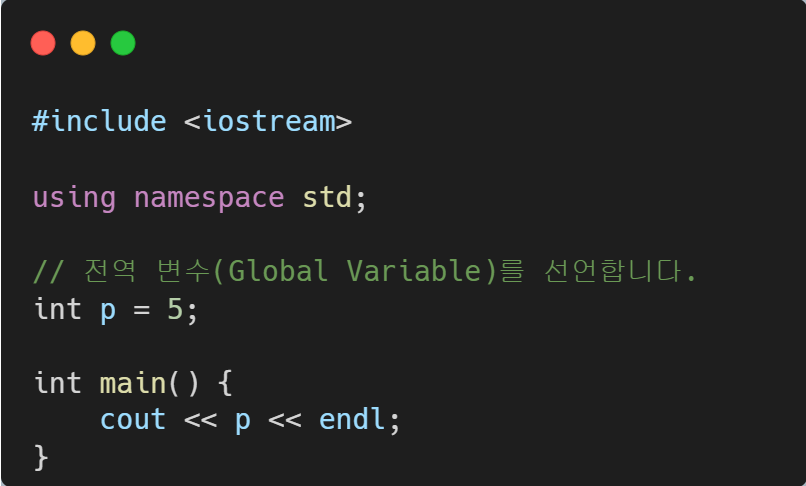

global_var.cpp

global_var.py

위는 C, C++, Python의 전역 변수 선언 예시입니다. 모두 출력 예시는 동일합니다. Java의 경우에도 전역 변수를 지원하는데, 클래스 변수와 인스턴스 변수로 나뉩니다.

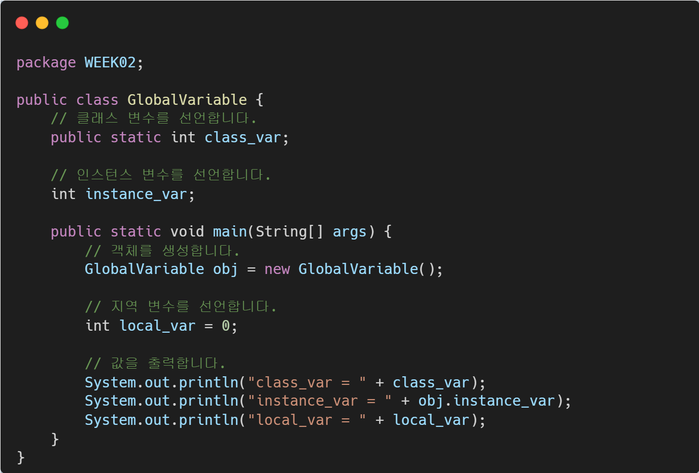

WEEK02/GlobalVariable.java

<aside>
📢 **출력 예시**

class_var = 0
instance_var = 0
local_var = 0

</aside>

위는 **클래스 변수**, **인스턴스 변수**, **지역 변수**를 선언하고 초기화한 예시입니다. 클래스 변수와 인스턴스 변수는 자동 초기화된다는 특징이 있습니다.

**클래스 변수**(*Class Variable*)는, 객체를 따로 생성하지 않더라도 사용할 수 있는 변수고, 앞에 **static**을 붙입니다. 클래스 변수는 프로그램이 종료될 때까지 메모리를 계속 차지하므로, 과도하게 사용할 경우, 프로그램 실행 속도에 부정적인 영향을 미칠 수 있습니다.

WEEK02/ClassVariable.java

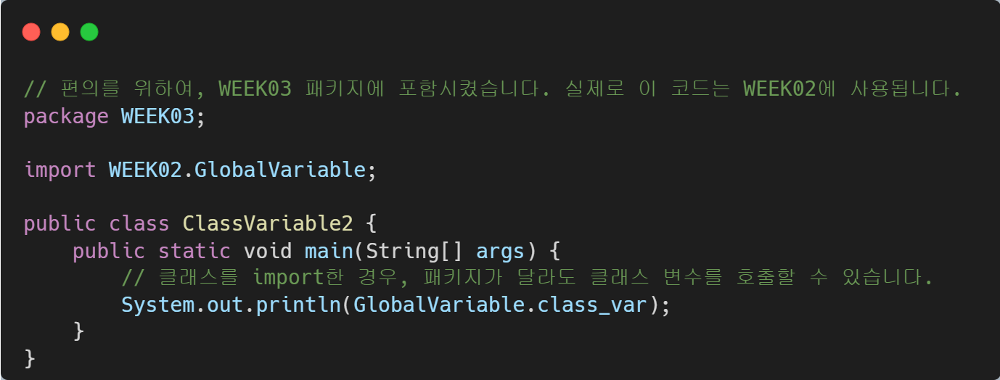

WEEK03/ClassVariable2.java

<aside>
📢 **출력 예시**

0

</aside>

클래스 변수가 선언되면, 클래스 이름이 같은 모든 영역에서 해당 변수를 호출할 수 있으므로, 여러 개의 프로젝트를 동시에 사용할 경우, 주의가 필요할 수 있습니다. 클래스 변수의 접근 제어 지시자를 public으로 설정한다면, 다른 패키지에서도 클래스 변수를 호출할 수 있습니다.

**인스턴스 변수**(*Instance Variable*)은, 클래스 영역에서 선언하여 객체가 생성될 때 만들어지고 Java가 동적으로 할당한 객체들이 저장되는 영역인 heap에 저장됩니다. 이 변수는 생성된 기간동안 호출하여 사용할 수 있다는 특징을 가집니다.

인스턴스 변수는 인스턴스(객체)를 생성하지 않으면, 호출할 수 없습니다. 

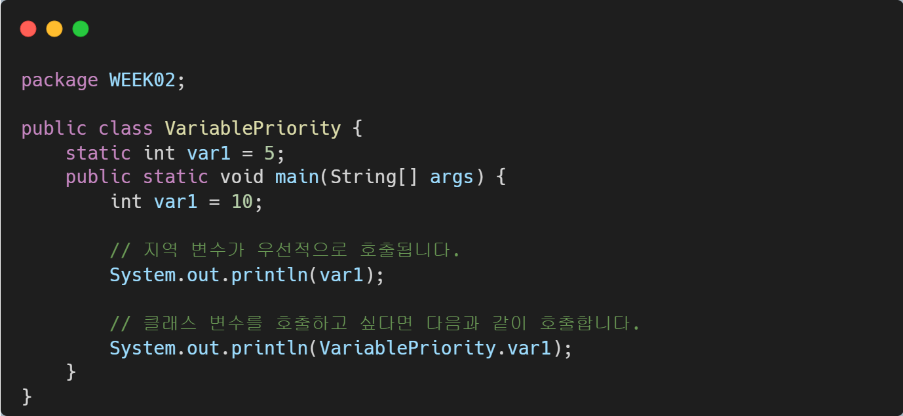

WEEK02/VariablePriority.java

<aside>
📢 **출력 예시**

10

5

</aside>

또한, 변수가 호출될 때 **지역 변수가 전역 변수보다 우선 호출**됩니다.

cf. **지역 변수**(*Local Variable*)는 **stack 영역에 저장**됩니다. stack은 메서드 호출과 반환, 지역 변수 및 매개변수 저장 등을 담당합니다.

---

## 타입 변환, 캐스팅 그리고 타입 프로모션

두 변수의 자료형이 동일할 경우, 한쪽 변수값을 다른 변수에 저장할 수 있습니다. 

### 자동 타입 변환

기본적으로, 두 변수의 자료형이 다른 경우, 특정 조건에만 자료형이 자동으로 변환될 수 있습니다. 이 경우를 **자동 타입 변환**(*Promotion*)이라고 합니다.

WEEK02/Promotion.java

<aside>
📢 **출력 예시**

3.0

</aside>

자동 타입 변환은 값의 허용 범위가 작은 타입을 큰 범위에 저장될 때 발생합니다. 다음은, 범위의 크기를 역순으로 나열한 것입니다.

byte < short < int < long < float < double

예외적으로 정수형인 char는 음수를 포함하지 않기 때문에, 허용 범위가 작은 byte 타입마저 자동으로 char형으로 변환할 수 없습니다.

### 강제 타입 변환

범위가 큰 변수더라도 범위가 작은 변수로 변환시킬 수 있는데, 이를 **강제 타입 변환**(*casting*)이라고 합니다.

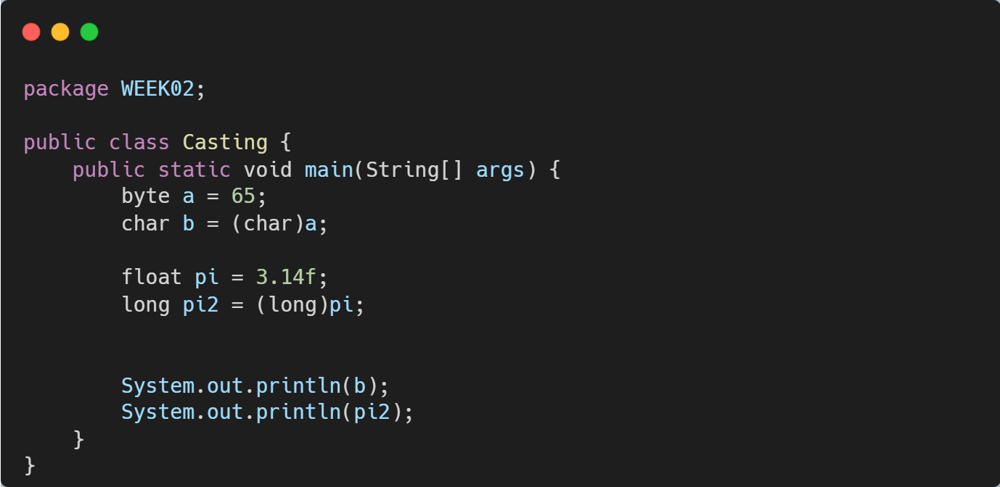

WEEK02/Casting.java

<aside>
📢 **출력 예시**

A

3

</aside>

int는 float보다 범위가 작지만, 강제 타입 변환을 통해 float형 변수를 int형으로 변환할 수 있습니다. 이 경우, 소숫점이 제거됩니다.

### 연산의 자동 타입 변환

정수끼리의 연산은 모두 JVM은 기본적으로 int로 인식합니다. 이는 나눗셈도 포함이므로, 다음 소스 코드의 출력 결과도 우리의 예상과 다르게 나옵니다. 

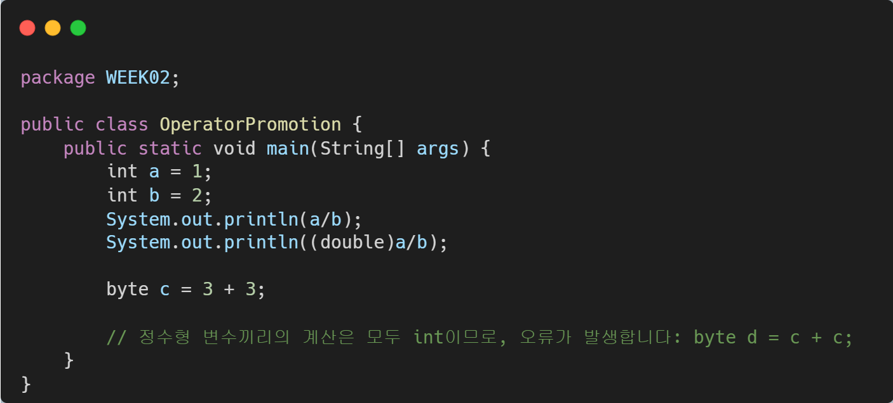

WEEK02/OperatorPromotion.java

<aside>
📢 **출력 예시**

0

0.5

</aside>

따라서, 우리가 원하는 값인 0.5를 출력하기 위해서는 둘 중 하나의 자료형을 실수형으로 바꿔야 합니다. **자료형이 다른 값끼리 연산을 할 경우, 범위가 큰 자료형으로 저장**이 되기 때문입니다.

또한, 정수형 변수를 더하는게 아닌, 숫자를 더하는 것은 int로 변환되지 않습니다.

실수끼리의 연산은 기본적으로 double로 인식합니다.

### 문자열의 연산과 강제 타입 변환

문자열은 + 연산자를 통해, 다른 자료형과 연산을 할 수 있습니다. 문자열과의 연산보다 우선적으로 연산되는 것이 없다면, **문자열과의 연산에서 다른 자료형은 모두 문자열로 자동 타입 변환**됩니다.

WEEK02/StringPromotion.java

<aside>
📢 **출력 예시**

Hello, World!55
Hello, World!10
Hello, World!25
10Hello, World!

</aside>

문자열을 기본 타입으로 강제 타입 변환하고 싶다면, 다음 코드를 통해 변환할 수 있습니다.

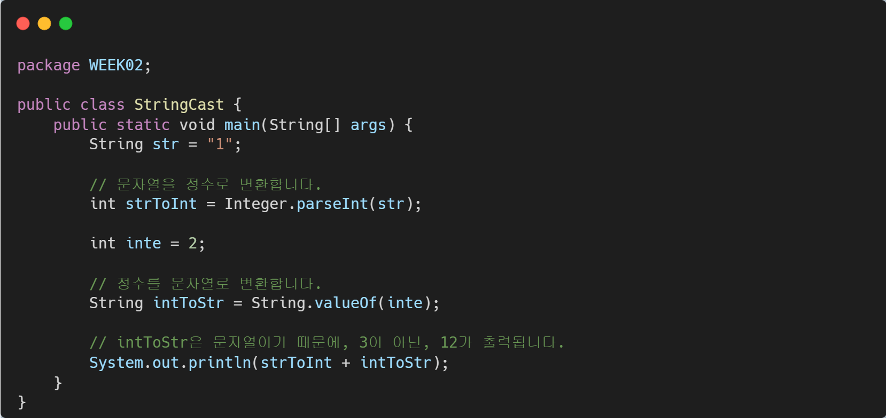

WEEK02/StringCast.java

<aside>
📢 **출력 예시**

12

</aside>

반대로 숫자를 문자열로 변환하고 싶은 경우에는 다음과 같이 사용하면 됩니다.

String str = String.valueOf();

---

## 참조

**참조**는 **주솟값을 저장**하는 것입니다.

### 메모리 사용 영역

JVM은 운영체제에서 할당 받은 메모리 영역을 **메서드 영역**(*Method Area*), **힙 영역**(*Heap Area*), **JVM 스택**(*Stack*)으로 구분합니다.

**메서드 영역**은 JVM이 시작될 때, 생성되고 모든 **스레드**(*thread*)*를 공유하는 영역입니다. 코드에서 사용되는 class를 **class loader**을 통해 읽고, class별로 **정적**(*static*) 필드와 상수, 메서드 코드, **생성자**(*constructor*)** 코드 등을 분류해서 저장합니다.

**힙 영역**은 객체와 배열의 **실제 값 생성**되는 영역이고, 이들은 **JVM 스택 영역의 변수 또는 다른 객체가 참조**합니다. 참조하는 값이 없다면, **가비지 컬렉터**(*Garbage Collector*)**가 감지**하여, **자동으로 해제**합니다.

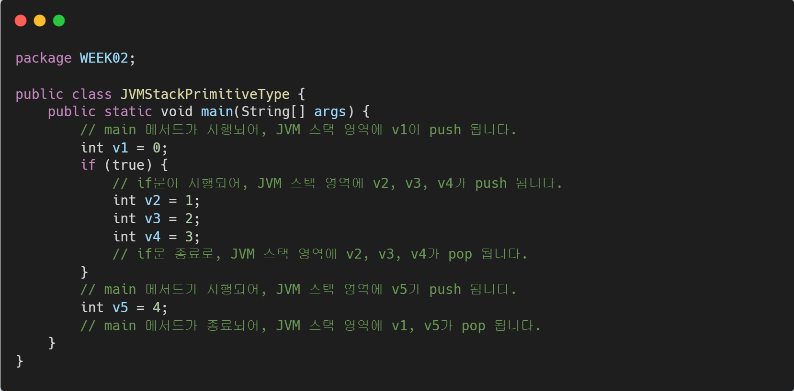

WEEK02/JVMStackPrimitiveType.java

**JVM 스택 영역**은, 메서드를 호출하면 프레임을 추가(*push*)하고, 종료되면 프레임을 제거(*pop*)하는 동작을 수행합니다.

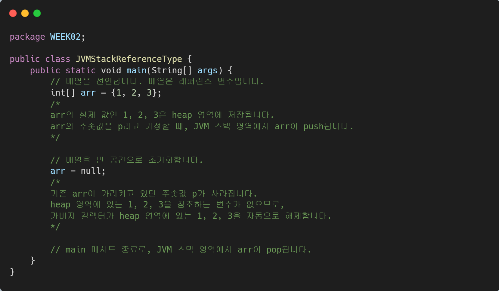

WEEK02/JVMStackReferenceType.java

프리미티브 변수는 스택 영역이 직접 값을 가지고 있지만, 래퍼런스 변수는 스택 영역에 힙 영역의 객체 주소를 가집니다.

### 참조 변수의 연산

**프리미티브 변수**는 ==, != 연산을 ‘**같다**’와 ‘**같지 않다**’로 인식하지만, **래퍼런스 변수**는 동일한 객체를 **참조하는지의 여부**로 이를 인식합니다.

즉, 래퍼런스 변수들이 같은 값을 참조할 경우 ==를, 다른 값을 참조할 경우 !=를 의미합니다.

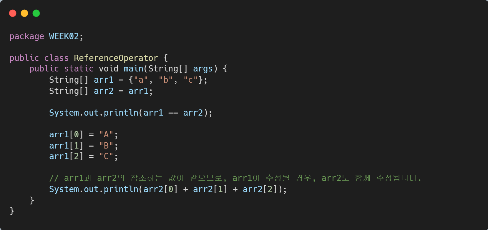

WEEK02/ReferenceOperator.java

<aside>
📢 **출력 예시**

true
ABC

</aside>

arr1과 arr2는 같은 값을 참조하므로, arr1 == arr2는 항상 true가 출력됩니다.

### new 연산자

배열과 문자열은 둘 다 래퍼런스 변수지만, 두 개는 참조하는 방식이 약간 다릅니다.

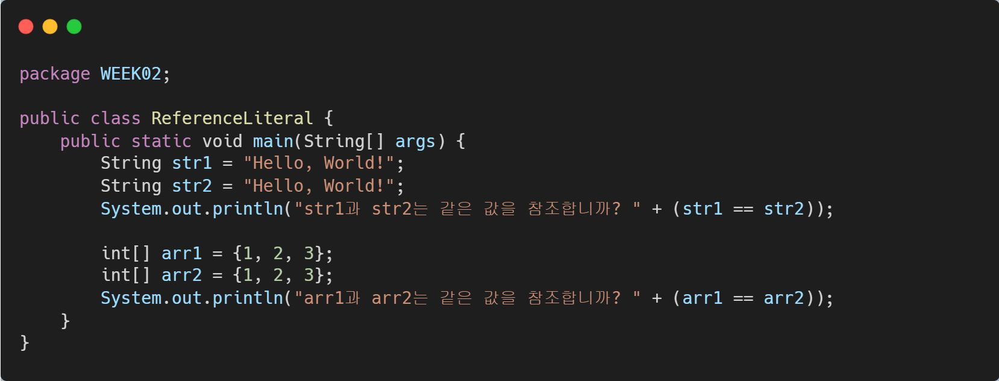

WEEK02/ReferenceLiteral.java

<aside>
📢 **출력 예시**

str1과 str2는 같은 값을 참조합니까? true
arr1과 arr2는 같은 값을 참조합니까? false

</aside>

**문자열은 값이 같은 경우 항상 같은 값을 참조**하고, **배열은 서로 다른 값을 참조**합니다. 하지만, 입력한 값이 같다고 하더라도 참조하는 값이 달라야 하는 상황이 생길 수도 있습니다. 이 경우에는 **new 연산자**를 사용합니다.

WEEK02/NewReferenceLiteral.java

<aside>
📢 **출력 예시**

str1과 str2는 같은 값을 참조합니까? false

</aside>

**new 연산자**는 **heap 영역**에 새로운 객체를 만들기 때문에, ‘**객체 생성 연산자**’라고도 부릅니다.

스레드*: 프로그램을 실행할 때, 실행 흐름의 최소 단위

생성자**: 객체의 초기화를 담당하는 메서드

---

## 배열

**배열**은 같은 타입의 데이터를 연속된 공간에 나열하고, 각 데이터에 **인덱스**(*index*)를 부여해놓은 자료구조입니다.

배열은 기본적으로 다음 조건을 만족해야 합니다.

- 배열 내 인덱스의 모든 자료형이 같다.
    
    배열의 정의에 따라, int형인 경우 모든 인덱스는 int, float형인 경우 모든 인덱스는 float여야 합니다.
    
- 한 번 생성된 배열은 크기를 변경할 수 없다.
    
    크기가 5인 배열을 생성한 경우, 프로그램 실행 도중, 배열의 크기를 줄이거나 늘릴 수 없습니다.
    

### 1차원 배열

배열을 선언하는 방법은 두 개가 있습니다.

WEEK02/ArrayDeclaration.java

배열은 **참조 변수**이므로, 선언시 **heap 영역에 그 값이 저장**되고, **이를 가리키는 주솟값이 stack에 저장**됩니다.

또한, 이들은 아무 값을 입력하지 않는다면, **타입의 기본값이 저장**됩니다. 또한, 배열이 참조할 것이 없다면, null 값으로 초기화할 수 있습니다.

배열을 생성하는 방법은 크게 두 가지로 나뉩니다. 값 목록으로 배열을 생성하거나, new 연산자를 이용하는 방법입니다.

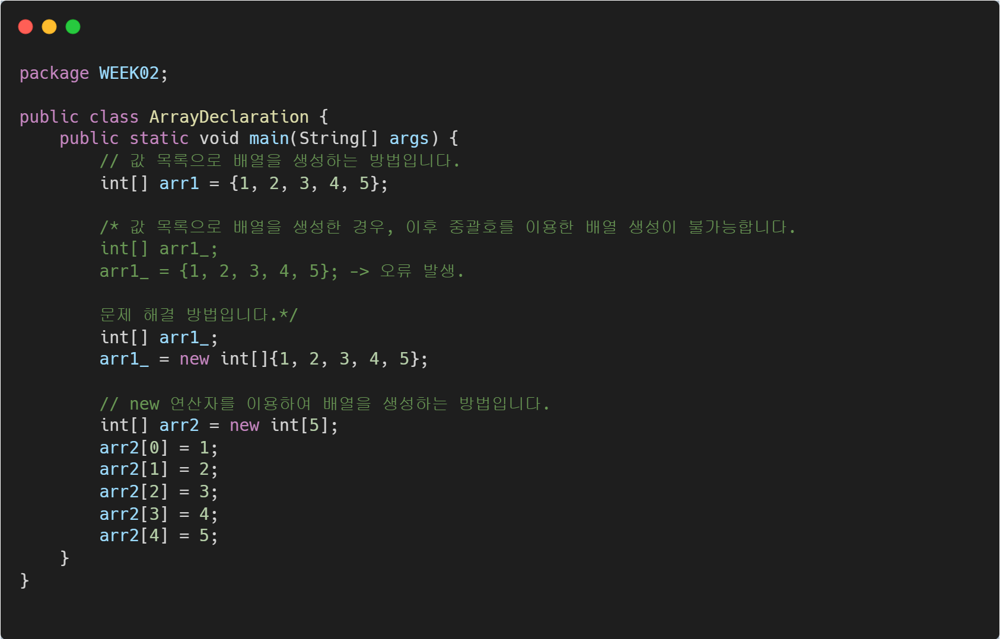

WEEK02/ArrayDeclaration.java

**new 연산자를 통해 배열을 생성**할 경우, **기본값으로 자동 초기화**됩니다.

**배열의 길이**란, 배열에 저장될 수 있는 전체 항목의 개수를 의미합니다. 코드에서 배열의 길이를 얻는 방법은 length **필드**(*field*)*를 읽는 것입니다.

WEEK02/ArrayLength.java

<aside>
📢 **출력 예시**

5

</aside>

**length 필드**는 **읽기 전용**이기 때문에, 값을 임의로 변경할 수 없습니다.

### 2차원 배열 및 다차원 배열

값이 행과 열 또는 그 이상으로 구성되어 있는 배열을 **다차원 배열**이라고 합니다. 3차원 이상의 배열은 직접 다루지는 않습니다. **2차원 배열**의 선언 방법은 다음과 같습니다.

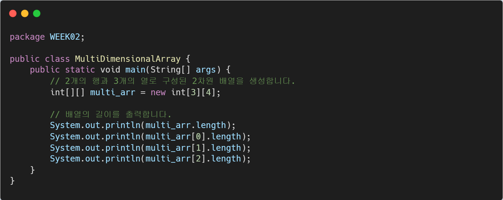

<aside>
📢 **출력 예시**

3
4
4
4

</aside>

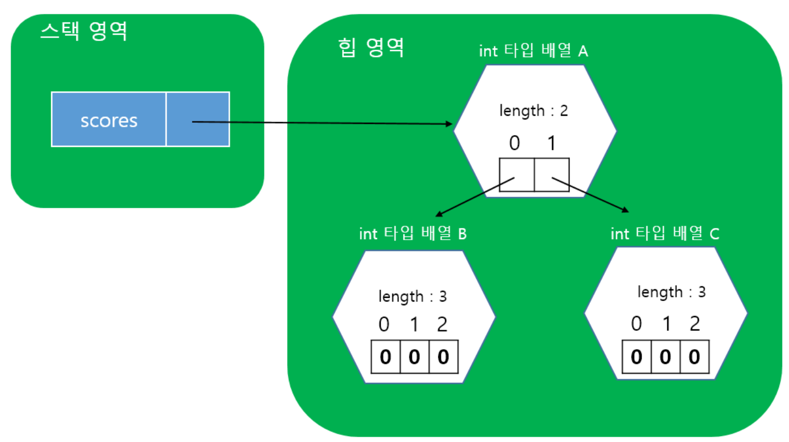

2차원 배열이 선언될 때, 가장 먼저 열의 개수만큼의 길이를 가진 배열 A가 heap에 저장되고, multi_arr는 stack 영역에 생성되어, A를 참조하게 됩니다. 배열 A의 3개의 값은 또한, heap 영역에 저장되어 있는, 행의 개수만큼의 길이를 가진 배열 B, C, D에 각각 참조합니다. 따라서, 배열의 길이를 구해본다면, 위와 같은 결과가 발생하게 됩니다.

예를 들어, multi_arr.length는 배열 A를 참조하므로 길이는 3, multi_arr[0].length는 배열 B를 참조하므로 길이는 4가 됩니다.

또한, 2차원 배열은 수학의 행렬과 비슷하지만, 꼭 정방형일 필요는 없습니다.

WEEK02/NonSquareArry.java

이 경우, 다음과 같이 계단식으로 배열이 생성됩니다.

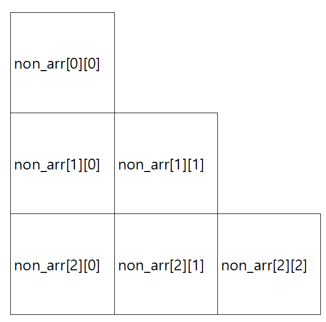

### 객체를 참조하는 배열

**래퍼런스 변수**를 배열로 사용할 경우, 그 배열은 객체들의 주솟값을 가지게 됩니다. 예를 들어, 문자열 배열의 경우, 배열의 각 항목은 **배열의 값이 아닌, String 객체의 주솟값**을 가지게 됩니다. 즉, String[] 배열은 String 객체를 참조하게 되는 것입니다.

즉, 다차원 배열과 비슷하게, stack 영역에는 heap에 저장된 String 타입 배열 객체를 참조하게 되고, 그 배열 객체의 값들은 각각의 String 객체를 참조하게 됩니다.

문자열은 그 값이 같으면 같은 주솟값을 가리키기 때문에, 문자열의 값이 같아도 다른 주솟값을 가리키고 싶은 경우, new를 사용해야 합니다.

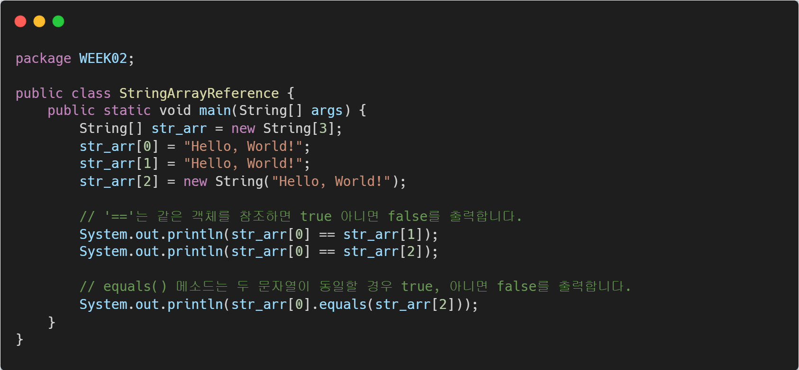

<aside>
📢 **출력 예시**

true
false
true

</aside>

0번째 값과 1번째 값은 같은 주소를 참조하고, 2번째 값은 다른 주소를 참조합니다. 따라서, 위와 같은 결과가 발생합니다.

### 배열 복사

배열은 크기가 정해진 경우, 더 이상 크기를 변경할 수 없기 때문에, 더 큰 크기가 필요하다면, 기존 배열을 크기가 더 큰 배열에 복사하는 방법이 있습니다. 배열을 복사하는 방법은 **for문**을 이용하거나, **System.arraycopy() 메서드**를 사용합니다.

System.arraycopy() 호출하는 방법은 다음과 같습니다.

WEEK02/ArrayCopy.java

<aside>
📢 **출력 예시**

A, B, C, null, null

</aside>

복사한 새 배열의 항목은 이전 배열의 항목이 참조하는 객체와 동일합니다.

필드: 클래스의 상태를 나타내는 변수. 객체의 고유 데이터, 부품, 혹은 현재 상태를 저장하는 역할

---

## 타입 추론, var

**타입 추론**이란, 자료형이 정해지지 않은 변수에 대해 컴파일러가 변수의 타입을 스스로 찾아낼 수 있도록 하는 기능입니다. 자료형을 따로 명시할 필요가 없기 때문에, 소스 코드의 가독성을 높일 수 있습니다.

타입 추론을 하는 방법으로 **var**을 사용하는 방법이 있는데, var은 **지역 변수만 사용 가능**합니다. 하지만, var은 반드시 선언시 초기화가 필요하고, null 또는 배열, 람다식 타입을 추론할 수 없습니다.

WEEK02/VarType.java

<aside>
📢 **출력 예시**

55

10

</aside>

var1은 “5”를 String으로 추론하여, 연산시 정수를 문자열로 자동 타입 변환을 하였습니다.

var2는 5를 int로 추론하여, 연산시 두 정수의 합을 출력하였습니다.